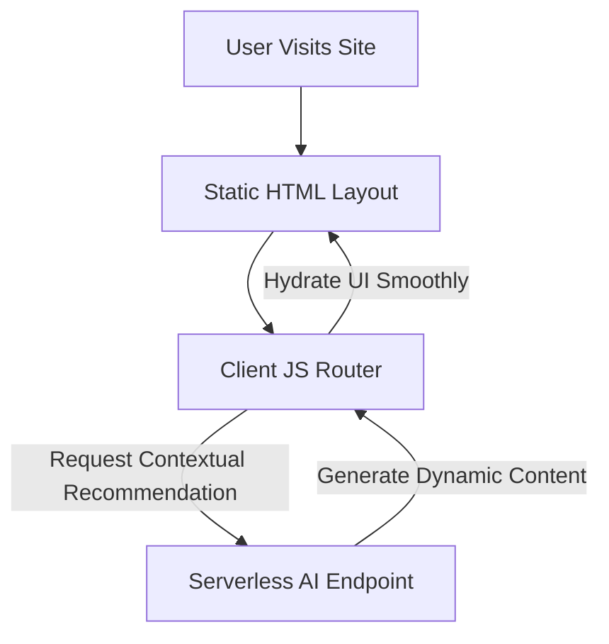

The web engineering landscape is undergoing a massive paradigm shift. Artificial Intelligence has transcended simple autocomplete models to become an active collaborator in design and development workflows.

From autonomous coding agents creating complete websites to natural language search engines, the way we build interfaces is changing. In this article, we'll analyze the impact of AI on static architectures and interface layouts.

---

## 1. Autonomous Coding & Design Systems

AI agents are now capable of executing multi-file implementation plans, resolving layout designs, and applying custom CSS properties. 

Rather than writing repetitive boilerplate code, developers are transitioning to roles centered on **architectural review** and **design alignment**. The engineering process is becoming faster:

1. **Prompt & Plan**: Describe the desired components, data models, and theme styles.
2. **Review & Approve**: Inspect the generated files and layout previews.
3. **Refine & Ship**: Deploy the static bundle directly to content delivery networks.

---

## 2. Blending Static Sites with Intelligent APIs

Static sites are secure and fast, but they have traditionally struggled with dynamic content. AI is solving this issue. By connecting static frontends to intelligent serverless APIs, we build pages that adapt dynamically while retaining speed.

This hybrid approach allows blogs and platforms to serve static content instantly, then hydrate custom sections (like recommendations or search answers) in the background.

---

## 3. The Shift to Semantic Search

Traditional keyword matching search is often limited. The next generation of web search involves running lightweight client-side semantic searches. By generating vector embeddings of articles and loading a small model in the browser, users can search static documents by conceptual meaning rather than exact words.

  
The Developer's Role

  
As developer agents handle more of the implementation details, understanding design fundamentals, user experience (UX), and API orchestration will become the primary focus of web engineers.

## Looking Ahead

The future belongs to light-weight, static-first architectures that connect to intelligent services. By mastering SSGs like Jekyll and combining them with modular design patterns, we prepare our systems for this upcoming web era.
